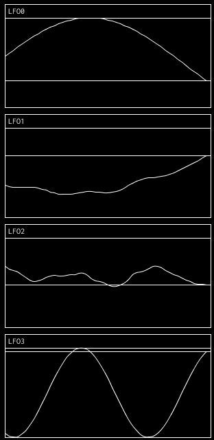
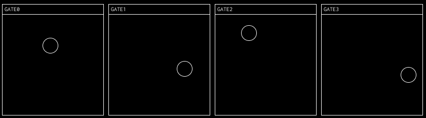
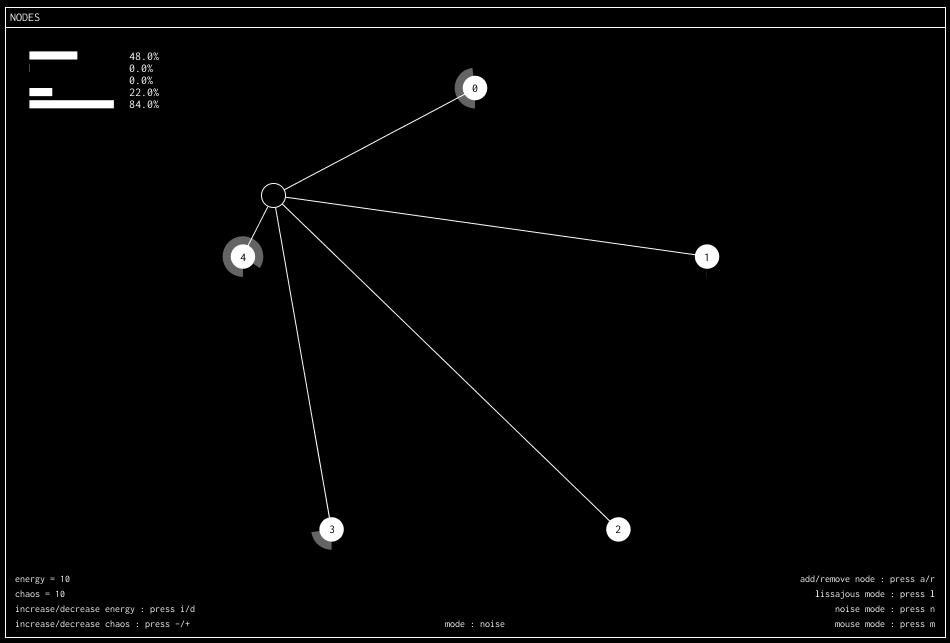
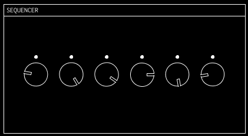
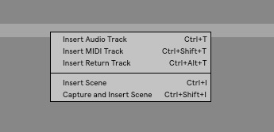
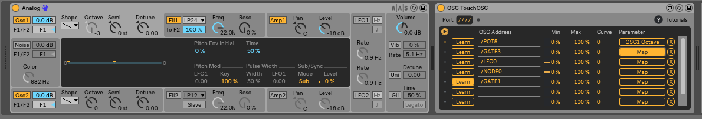

Menu 
- Requirments
- Usage
- Modules
    - LFO
    - Gate
    - Nodes
- How to use
    - With ableton

# noisedata
noise:data was created to serve audio generation as much as the visual generation
Each module sends OSC on its own way visualized graphicly in a minimal esthetic

## Requirements
- OscP5 (processing library)

## Usage
Duplicate "Module" class to create another module.

## Best practices
1. Create your sketch outside of noise_data. 
2. Think about what kind of data it could send on OSC.
3. Once your done, turn it into a module.

## The Modules

Each module send a OSC message. There are two types of messages : bangs and waves.
A trigger is a value switching from zero to one. It's an integer value.
A wave is a continuous signal ranging from zero to one. It's a float value.

### LFO :

lfo's can't be controlled (for now)
Each line module send a continuous signal.
The OSC messages are :
- /LFO0 value
- /LFO1 value
etc.

### Gate :

A ball bounces on every side of the module when the ball collides with one of those side a bang message is sent (1 or true)

### Nodes

The node module is a central point surrounded by other points
Each of those point are linked to the central point and they all send an osc value based on the distance separating them from the central point
By default you can controll the central point position manually but other options are available

#### Mouse mode
Can be activated on with **m** key on the keyboard
Manual mode move the mouse

#### Lissajous mode
Can be activated on with **l** key on the keyboard
the pointer moves following a [lissajous curve](https://en.wikipedia.org/wiki/Lissajous_curve)

- With **left/right/up/down** arrows you can controll the phases of the curve

 - With the **+/-** signs you can increase/decrease the A frequency
 - With the **i/d** signs you can increase/decrease the A frequency

#### Noise mode
Can be activated on with **n** key on the keyboard
the pointer moves based on a [perlin noise](https://en.wikipedia.org/wiki/Perlin_noise)

 - With the **+/-** signs you can increase/decrease the chaos
 - With the **i/d** signs you can increase/decrease the energy

### Sequencer

In term of osc sent this module is close to the ball module
Each circle has a "point" rotating on the circle, when the point reaches the little dot it sends a bang (1) through OSC

### Shortcuts :
#### Numpad keys :
As mentioned above you can create your own scenes, It can be really useful to create a music or live structure 

By default there are 7 scenes declared, you can access each of them with the numpad keys (1 to 7)

### How to use 

#### With ableton
##### TODO Make a video tutoriel
Launch noise:data
Launch Ableton 
Add a midi track (right clic Insert MIDI track)

Select the midi track 
You will need to [download](https://github.com/Ableton/m4l-connection-kit) the Ableton Connection Kit
Once you've unzip all the files go to **OSC TouchOSC**
Drag and drop on your midi track the **OSC TouchOSC.amxd**  file the module should appear

Add a instrument on the midi track

**On OSC TouchOSC module :**
Change the port number to **7777**
Click on **Learn** on the OSC TouchOSC
Some osc msg should be received (ex : /POT ) unclick the learn button after that
Click on map on the same line you've "learned" and select a knob you would like to modify on the instrument (the pan for example)
The knob values should automaticly adapt to the osc message

You're DONE :)

##### Demo file
We've setup a demo file to show how noise:data can be interfaced with ableton
Download this [project file](protocoll.network/medias/noisedata_ableton.zip)

